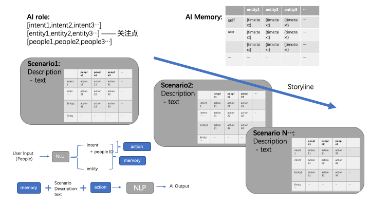

🔥🔥🔥运营日预告：*6月18~19日* 🔥🔥🔥

Version：Pre-release 0.1

-----------------

本项目致力于基于NLP预训练大模型为各类数字虚拟人打造"有趣的灵魂"。

不同于传统的 **"开放域对话"**，也并非 **"目标域对话"**（又称"任务型对话" task-oriented dialog)，我们提供的是一种 **"主题域对话"** 解决方案。三者的主要区别如下：

|开放域对话| 目标域对话   | 主题域对话   |
|--------|---------|---------|
|无对话目的| 有对话目的   | 有对话目的   |
|不强制完成目的| 强制完成目的  | 不强制完成目的 |
|无对话管理| 有对话管理   | 有对话管理   |
|无背景设定| 固定式背景设定 | 知识型背景设定 |

相对于目标域对话，主题域对话更加适合应用于虚拟人、数字演员、智能陪护以及教育等领域，并且在公共服务、客服等应用领域内可与目标域对话进行搭配组合以带来更好的体验。

本repo实现的是基于Python-Wechaty框架的的AI soul，并应用于我们的微信虚拟人"阿瓦达啃大瓜🍉"的长期运营中。

## 体验（for 普通用户）

请扫描如下二维码添加阿瓦达啃大瓜🍉，关注她朋友圈的"运营日预告"（也可留意本页面上方）。 我们会不定期进行有趣的运营日活动，仅面向已经添加了阿瓦达啃大瓜好友的微信用户。

 

**注意：您发给机器人的任何消息都将被视为不涉及任何隐私，对话内容可能被应用于后续研究以及模型训练或者被用于公开案例展示等**
**添加机器人账号意味着您理解并接受上述声明。另请勿在与机器人的对话中涉及敏感内容与词汇。**

因服务器容量以及微信相关政策限制，我将采用人工方式分批接受添加申请，请您发出好友申请后，耐心等待。

## 基于本方案进行内容创作（for 内容创作者）

本项目脱胎于一个有趣的创意——["可以与人类玩剧本杀的AI"](https://github.com/bigbrother666sh/shezhangbujianle)。

现在我们已经实现内容创作和编码的初步分离，这就意味着哪怕你没有任何代码基础，也可以基于本项目为自己的虚拟人定制一套有趣的灵魂！

然而这部分工作我们还在进行中，预计本月我们会发布第一版《创作手册》，如果您现在就迫不及待想开始创作，可以参考如下架构图并对照项目代码和/editor/examples/下的示例进行尝试。



如果您有优秀的创意，也欢迎直接与我联系（weixin：baohukeji）。

## 工程部署（for engineer）

本项目基于如下关键模块，建议先行了解并开通相关服务：

### 浪潮源1.0 NLP大模型API

[浪潮 源1.0](https://air.inspur.com/home) 是世界上最大的单体中文NLP预训练大模型，本项目基于该模型最新（2022.5）的dialog模型，使用其优异的情景对话生成能力。

请于这里进行账号申请和服务开通：[https://air.inspur.com/home](https://air.inspur.com/home) 

### rasa3.0

本项目使用rasa3.0进行对话意图识别，请参考我的另一个[repo](https://github.com/bigbrother666sh/rasa-paddlenlp-ernie/tree/deploy) 或者 [rasa官网](https://rasa.com/docs/)。

### 百度飞桨（PaddlePaddle）PaddleNLP UIE

本项目使用Paddlenlp的通用信息抽取UIE预训练模型进行实体识别，详情请参考[这里](https://github.com/PaddlePaddle/PaddleNLP/tree/develop/model_zoo/uie)

### Python Wechaty

本项目与微信的接口实现以及项目的整体骨架基于[Python Wechaty](https://github.com/wechaty/python-wechaty)。

如果你对此并不熟悉， 建议从这里起步：[Python Wechaty getting started](https://github.com/wechaty/python-wechaty-getting-started/)。


本项目环境为 python3.8或3.9

在完成以上准备工作后，你可以git clone本项目，并试着运行run.py， 如果缺失相关模块，可以尝试 pip install -r requirement.txt

祝好运！
 
# Citation

如果您在相关工作中参考或引用了本项目的部分或全部，请注明如下信息：

```
Author：bigbrother666sh
https://github.com/bigbrother666sh/Awada
Licensed under Apache2.0
```